# ☁️ Brand New AWS Account Setup — Secure Cloud Foundation  

This project demonstrates how to configure a **new AWS account** following real-world best practices in **security, billing control, and account organization**.  
It’s designed for students, cloud learners, and professionals who want a hands-on, production-style setup for AWS labs or portfolio projects.  

---

## 🧭 Overview  

By the end of this guide, you’ll have:
- A **dedicated AWS root account** protected with MFA.  
- One **IAM admin user** for all daily use (root stays idle).  
- A **monthly budget alert** to prevent surprise charges.  
- Organized screenshots and structure for documentation.  

All actions are done directly in the **AWS Console** — no CLI required.  
Each step below includes short notes and example screenshots.

---

## 🧰 Before You Start  

✅ **Dedicated email:**  
Create a new Gmail or Outlook account just for AWS (e.g., `aws.labs.yourname@gmail.com`).  
Keep this separate from personal email to isolate billing and recovery.

✅ **Authenticator app:**  
Install **Duo Mobile**, **Authy**, or **Google Authenticator** on your phone — you’ll need it for MFA.  

✅ **Payment method:**  
Have a debit or credit card ready (AWS makes a temporary $1 charge to verify).  

✅ **Password manager (recommended):**  
Use Bitwarden, 1Password, or similar to store your AWS root and IAM credentials safely.

✅ **Browser:**  
Create a new browser profile named “AWS Root” so your logins stay isolated.

---

## 🔑 Step 1 – Create AWS Account  

1. Go to **[https://portal.aws.amazon.com/billing/signup](https://portal.aws.amazon.com/billing/signup)**  
2. Select **Personal Account** → enter your new dedicated email and strong password.  
3. Add contact info, verify phone, and payment method (expect a $1 authorization).  
4. Choose **Basic (Free)** support plan.  
5. Check your email for a **Welcome to AWS** message and confirm.  

You can now sign in at **[https://console.aws.amazon.com/](https://console.aws.amazon.com/)** as the **Root user**.

---

## 🔐 Step 2 – Enable MFA on Root Account  

1. In the AWS Console search bar, type **IAM** → open **IAM Dashboard**.  
2. Under **Security recommendations**, find **Add MFA to your root user**.  
3. Click **Manage MFA** → choose **Authenticator app** → scan the QR code using **Duo Mobile** (or any MFA app).  
4. Enter the two 6-digit codes → click **Assign MFA**.  
✅ You’ll see a green check mark next to “Root user MFA enabled.”  

**📸 Screenshots:**  

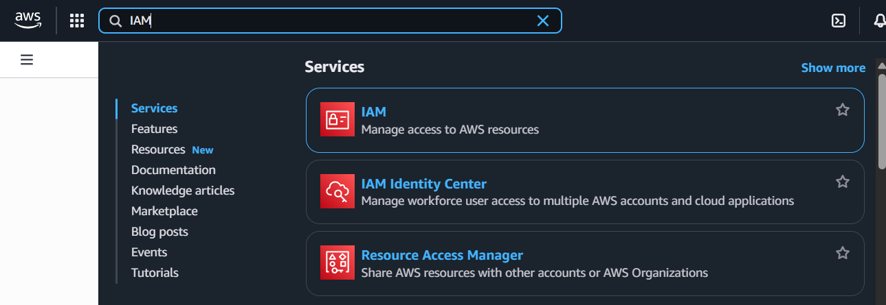  
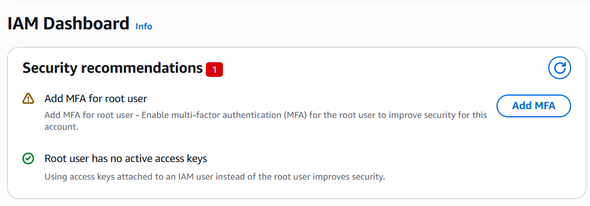

---

## 🧾 Step 3 – Create an Account Alias  

1. Still in the **IAM Dashboard**, look on the right under **AWS Account** → click **Create alias**.  
2. Enter any simple name, e.g. `aykhan-labs`, then click **Create alias**.  

Your sign-in URL becomes:  
https://aykhan-labs.signin.aws.amazon.com/console

Easier to remember than the default account number.

**📸 Screenshots:**  

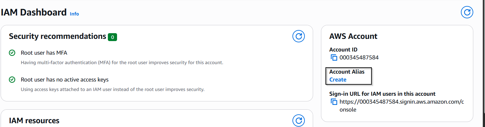  
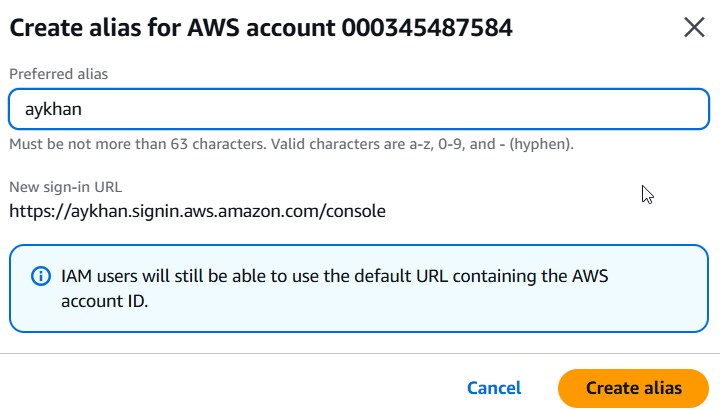

---

## 👤 Step 4 – Create an Admin User  

1. In the IAM Dashboard left panel, open **Account management › User groups**.  
2. Click **Create group** →  
   - Name: `Admins`  
   - Attach policy: **AdministratorAccess**  
   - Click **Create group**.  

3. Then go to **Users › Create user** →  
   - Name: `aykhan-admin`  
   - Console access: **Enabled**  
   - Password: **Auto-generate** + require reset ✅  
   - Add user to group: **Admins** → **Create user**.  

4. Copy the **Console sign-in URL** and temporary password shown at the end.  
   - Open the URL in a new tab  
   - Log in as `aykhan-admin`  
   - Reset the password  

5. After login, open **IAM** again and enable **MFA** for this new admin user (same steps as for root).  

**📸 Screenshots:**  

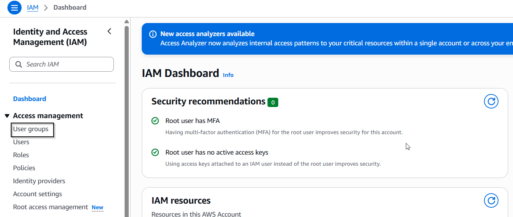  
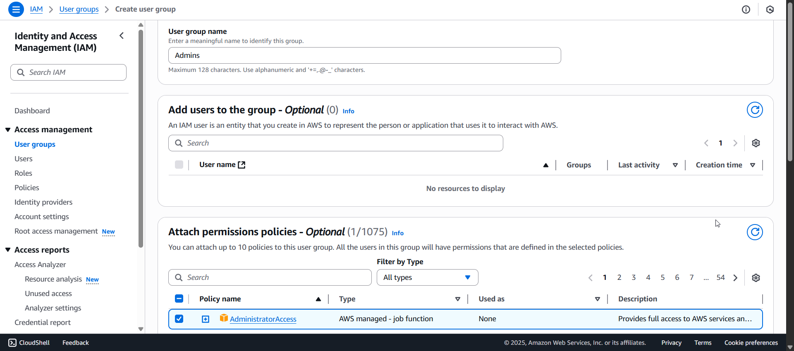  
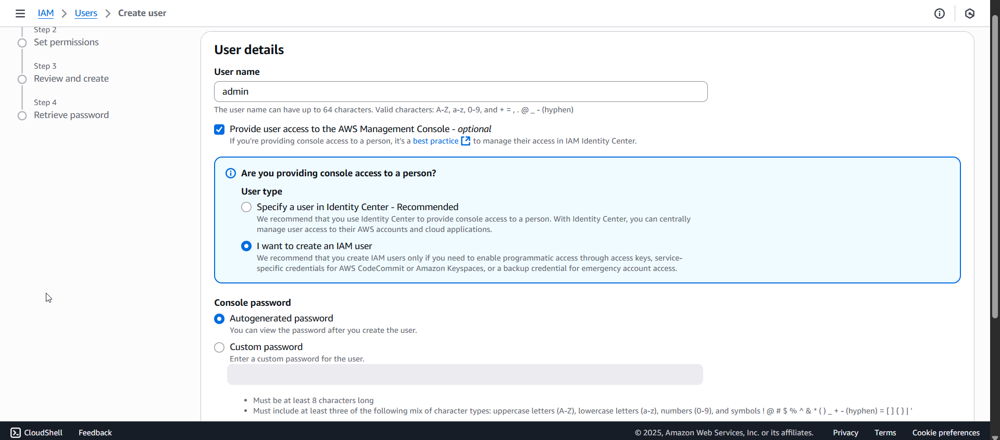  
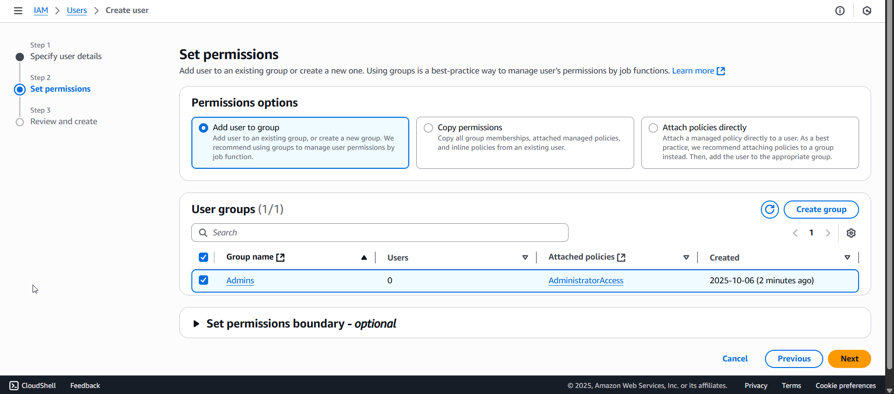  
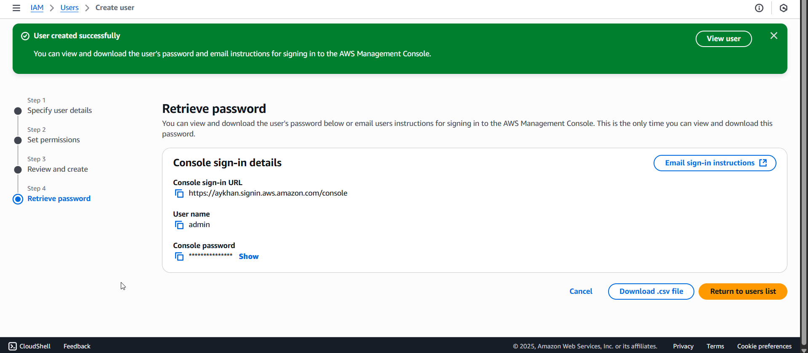  
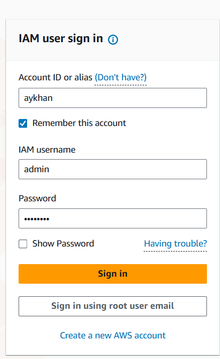

---

## 💰 Step 5 – Create a Monthly Budget Alert  

1. In the search bar, type **Billing** → open **Billing & Cost Management**.  
2. Left panel → **Budgets and planning › Budgets** → **Create budget**.  
3. Choose **Monthly cost budget** (template).  
4. Fill out:
   - **Budget name:** `Monthly-10USD-Limit`  
   - **Amount:** `10`  
   - **Alert recipients:** your email  
   - **Alert type:** *Actual cost ≥ 100%*  
5. Click **Create budget**, then confirm the email AWS sends you.  

✅ You’ll now get an alert if your usage exceeds $10 in a month.

**📸 Screenshots:**  

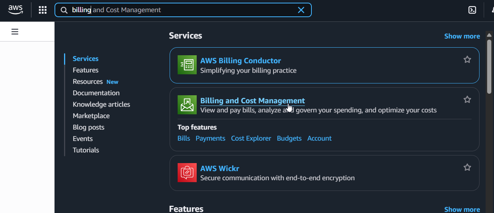  
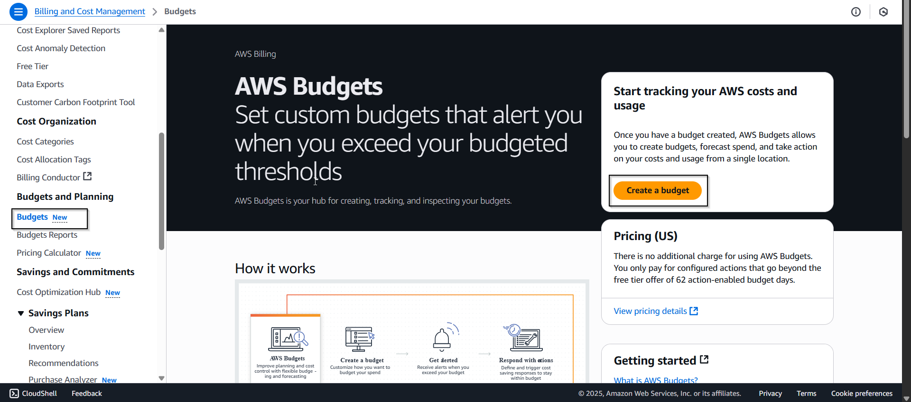  
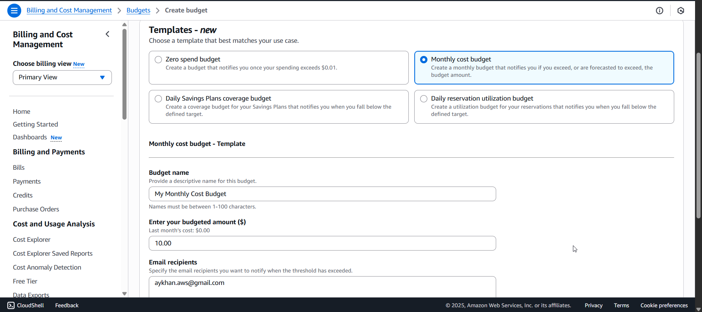

---

## ✅ Final Setup Summary  

| Area | Status |
|------|---------|
| Root user MFA | ✅ Enabled |
| IAM admin user | ✅ Created |
| MFA for admin | ✅ Enabled |
| Account alias | ✅ Created |
| Monthly budget alert | ✅ Active |

Your account is now secured and cost-protected.  
Use the **admin user** for everything; sign in as **root** only for billing or recovery.

---

## 🧠 Pro Tip (Optional Next Step)  

To get early warnings about unusual spend spikes, enable **Cost Anomaly Detection**:  
- In the console, search **Cost Anomaly Detection**.  
- Click **Create monitor** → choose *Service monitor* → add your email → confirm subscription.  
AWS will email you if it detects abnormal activity.

---

## 📁 Repository Structure  

```
brand-new-aws-setup-guide/
├─ README.md
├─ screenshots/
└─ notes/
```


---

## 🔖 Tags  
`#AWS` `#CloudSecurity` `#SolutionsArchitect` `#BudgetAlert` `#IAM`  

---

### © 2025 Aykhan Pashayev  
Built for hands-on AWS learning and professional documentation.

